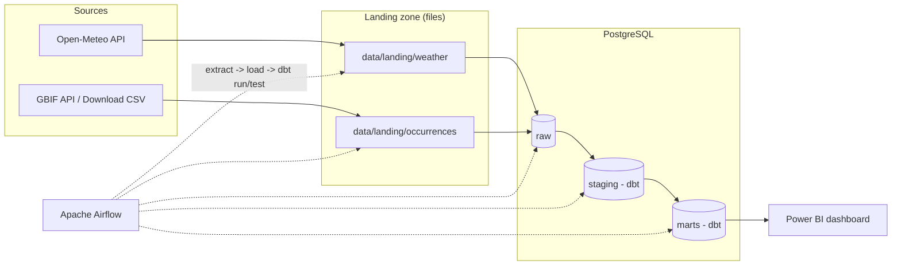
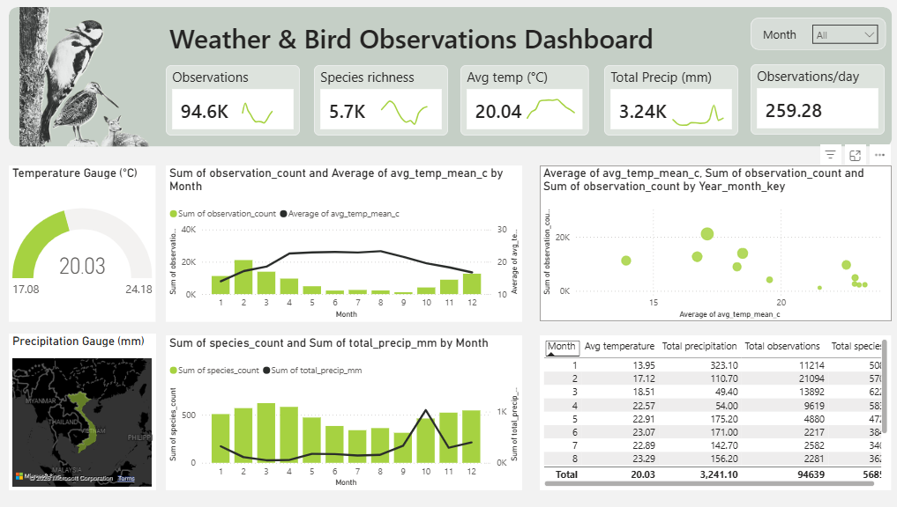

# Data Engineer Portfolio - Van Anh

Welcome to my portfolio!

My name is Van Anh. I build end-to-end data pipelines and analytics-ready models from API extract and landing zones through warehouse loads, dbt transformations, orchestration, and Power BI dashboards. I focus on reliable ELT layers, clear metric definitions, and insights that support decision-making.

My technical toolkit includes Python, SQL, PostgreSQL, dbt, Apache Airflow, Docker, dimensional modeling (star schema), and Power BI (Power Query, DAX).

This portfolio showcases Data Engineering / Analytics Engineering projects that demonstrate pipeline design, data modeling, orchestration, and BI storytelling.

## Portfolio Projects

* Weather & Biodiversity ELT + Power BI
  * [Weather-data-ELT](./Weather-data-ELT): Open-Meteo weather ELT (Docker, Postgres, dbt, Airflow)
  * [ELT Pipeline - GBIF Biodiversity](./ELT%20Pipeline%20-%20GBIF%20Biodiversity): GBIF bird occurrences ELT (Docker, Postgres, dbt, Airflow)
  * [GBIF & Weather dashboard (Power BI)](./GBIF_Weather_Dashboard.pbix)
* Related standalone repo: [gbif-biodiversity-elt](https://github.com/vananhkieuthanh-arch/gbif-biodiversity-elt)

## Projects Summary

#### Python + Postgres + dbt + Airflow + Power BI | Weather & Biodiversity (Vietnam 2023)

Built an end-to-end ELT stack to study how temperature and precipitation co-vary with bird observation volume and species richness in Vietnam (2023).

- **Extract / land:** Open-Meteo weather API and GBIF occurrence data into a file landing zone  
- **Load:** Idempotent loads into Postgres `raw` tables  
- **Transform:** dbt staging -> dimensions/facts -> month-grain marts (`year_month_key` join)  
- **Orchestrate:** Airflow DAGs for extract -> load -> `dbt run` / `dbt test`  
- **Analyze:** Power BI dashboard for monthly weather vs observations and species richness  

**Key design choices:** medallion-style layers (raw -> staging -> marts), star-schema modeling, distinct species name for richness (not a sum of monthly counts), and containerized local Postgres + Airflow.

### Architecture overview

### Medallion layers

| Layer | Schema | Role |
|-------|--------|------|
| Bronze | `raw` | Landed API/CSV data + JSONB payload where applicable |
| Silver | `staging` | Cleaned / renamed models (dbt) |
| Gold | `marts` | `dim_*`, `fct_*`, weather & species-richness marts |
| Meta | `meta` | ETL run log |

## Stack

| Area | Tools |
|------|--------|
| Languages | Python, SQL |
| Warehouse | PostgreSQL |
| Transform | dbt |
| Orchestration | Apache Airflow |
| Containers | Docker Compose |
| BI | Power BI |

## Education

* Foreign Trade University, HCMC Vietnam: Bachelor of International Business (GPA 3.2/4.0)
* HackerRank: SQL (Advanced), Python (Intermediate)
* DataCamp: Python, SQL, dbt, Snowflake, Airflow, Docker, Data Warehousing
* IELTS: Overall 7.5

## Contact me

Thank you for visiting my portfolio.

* Email: vananh.kieuthanh@gmail.com
* LinkedIn: https://www.linkedin.com/in/van-anh-kieu-thanh/
* Data Analyst portfolio: https://github.com/vananhkieuthanh-arch/My-Data-Analyst-Portfolio
